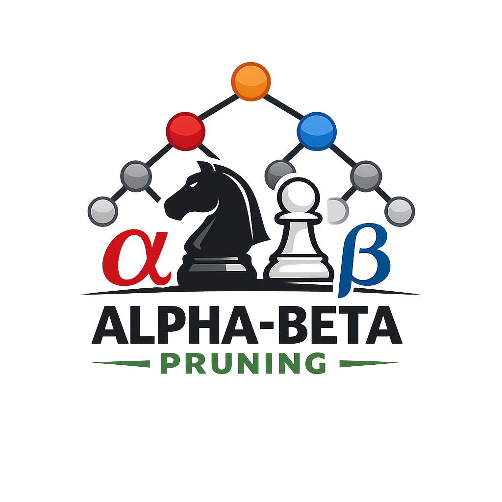

# CS 362 Artificial Intelligence and Machine Learning
**Spring 2026**  
**Due: Thursday, Febrary 4th at 5:00 pm.**  
**60 points**  

# P2 - AI Search - Alpha-Beta Pruning

## Overview 

**Alpha-beta** pruning is an optimization technique for the **minimax** algorithm, used in decision-making and game theory. It reduces the number of nodes evaluated in the game tree by eliminating branches that cannot possibly influence the final decision. 

The algorithm maintains two values, alpha and beta, representing the minimum and maximum scores the maximizing and minimizing players are assured of, respectively. By updating these values during traversal, branches that cannot improve the outcome are pruned, resulting in a significant reduction in computation (and storage), especially in deep game trees (such as chess), without affecting the final result.

---
## Part 1. Alpha Beta Pruning (30 points)

Create a **sample binary tree** with x16 random values using the sample code provided. Use the Python sample code 
posted ie, [`alphaBeta.py`](alphaBeta.py). Capture and submit a **screenshot** of the tree.  Choose a tree that results in **at least three pruning events**including at least one that occurs above the leaf nodes. Note: to generate sample trees, set the random seed. Trees must differ from detailed class examples.

**Draw the tree with the Alpha and Beta values** shown for each node. Show the branches that would be pruned. Show the Alpha and Beta values at each level as demonstrated in the class examples.

Work with another student and agree on the **same starting binary tree**.  

You must each **submit your own hand-drawn tree**, but you are encouraged to discuss and compare results. Note the person (or persons) on your work submitted.  

See [blank_tree.pdf](https://github.com/ProfLehman/cs362_spring_2026/blob/main/problem_sets/P3_Search_Alpha_Beta/blank_tree.pdf)

---
## Part 2. Analysis and Further Research (30 points)

**On your own** (not as a group), answer each of the following questions using an AI bot, Internet Search, print, or web resources.  

List any AI system (or systems) you used to assist with the homework and briefly (1-sentence) describe how you used the system.

1. Write an **overview** of Alpha-Beta pruning. (three to four or more paragraphs)  

2. Briefly list **four additional two-player games** (beyond tic-tac-toe, chess, checkers, connect-four) that could use alpha-beta pruning. (one or two sentences each)  

For #3, #4, #5, and #6 pick **one** of the games you listed for #2

3. Describe the "search" space (one or two paragraphs). Estimate the search space size at each ply and provide actual values if available (include references if applicable). (two or more paragraphs)

4. Has this game been "solved"?  If so, by whom? List the web-link or reference supporting your answer. (two paragraphs) (one or more paragraphs)

5. Describe a storage requirement for **one state** of this game. Show the game state and storage.

6. Using your storage option for #5, estimate the storage needed to store all possible moves.

---

## Submitting your Assignment

Upload a copy of your answers for Part 2, and submit a paper copy of your tree for Part 1.

11 x 14 paper is available from Prof. Lehman

-- end --

