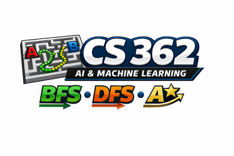

# CS 362 Artificial Intelligence and Machine Learning
**Spring 2026**  
**60 points**  
**Due: Tuesday, February 17, 2026 at 5 pm.**
# P4 - AI Search - Algorithms - Draft



## Overview 

**Breadth-First Search (BFS)**, **Depth-First Search (DFS**), and **A-Star Search** are fundamental 
to the field of Artificial Intelligence (AI) as they serve as foundational concepts for 
implementing AI solutions to a wide range of applications.  

In this assignment you will compare these three algorithms by running them on a set of mazes and analyzing performance.

### Starter Files

Use the provided files:

1. [`p4_maze_creator.py`](p4_maze_creator.py) – Text-based maze generator that creates a maze file using `X` and `.`, note you must add A and B;
2. [`p4_maze_search.py`](p4_maze_search.py) – Runs BFS, DFS, and A-star algorithms
displaying steps explored and number of steps to solution, and storing history file to be used by viewer
3. [`p4_maze_viewer.py`](p4_maze_viewer.py) – view history files to show how path found


---

## Part 1 — Create Six Mazes

Begin by creating the **six mazes** for your trials. Use [`p4_maze_creator.py`](p4_maze_creator.py) to create your mazes.

You will have **two different sizes (10 x 15, 20 x 40)**.

You will have **three different types (empty, 5% walls, 35% walls)**

* `A` = start
* `B` = goal
* `X` = wall / blocked cell
* (space or `.`) = open cell 
* You will need to place the start `A` and stop `B` values in the maze files. 
* Use the same `A` and `B` values for each maze size.
* All mazes must be solvable (there must be at least one valid path from A to B).


### Mazes with suggested file names

| Maze | Filename                    | Table Size (approx.) | Maze Type                         |
|:-----:|-------------------------|----------------------|-----------------------------------|
| 1     | maze_10_15_empty.txt    | 10 rows × 15 columns | Empty with `A` and `B`             |
| 2     | maze_10_15_light.txt    | 10 rows × 15 columns | Light walls (5% `X`)               |
| 3     | maze_10_15_heavy.txt    | 10 rows × 15 columns | Heavy walls (35% `X`)              |
| 4     | maze_20_40_empty.txt    | 20 rows × 40 columns | Empty with `A` and `B`             |
| 5     | maze_20_40_light.txt    | 20 rows × 40 columns | Light walls (5% `X`)               |
| 6     | maze_20_40_heavy.txt    | 20 rows × 40 columns | Heavy walls (35% `X`)              |


---
### Sample Mazes

**Sample Maze 1 — 5×10 Empty**

```
A.........
..........
..........
..........
.........B
```

**Sample Maze 2 — 5x10 Light Walls 5%**
```
A.X.......
......X...
..........
.........X
.........B
```

**Sample Maze 3 — 5×10 Heavy Walls 35%**

```
A.....XXX.
...X..X.X.
...XX.....
...XX.....
.......XXB
```


---
## Part 2 — Run Trials (x18 searches)

Using the six mazes you created in Part 1, use [`p4_maze_search.py`](p4_maze_search.py) to search using **BFS**, **DFS**, and **A-star** algorithms.

For **each run** record:

1. **Number of Steps** = length of the final path from `A` to `B` (how many moves along the solution path).
2. **Steps of Steps Explored** = number of states/cells/nodes explored during the search (how many positions the algorithm examined/expanded).
3. **Save the history** for each of your **x18 runs** ie. maze_5_10_empty_BFS.csv, maze_5_10_empty_DFS.csv, etc ...

You will have a total of **18 searches**.

Use a table similiar to the following to record your results. Sample filenames are shown. You can remove these from your document, but are added here for clarity.

### Sample Table

| Trial | Maze Size        | Maze Type              | Algorithm | Steps | Steps Explored | Maze File                | History File                         |
|:-----:|------------------|------------------------|-----------|:-----:|:--------------:|--------------------------|--------------------------------------|
| 1     | 10 × 15          | Empty                  | BFS       |       |                | maze_10_15_empty.txt     | maze_10_15_empty_BFS.csv              |
| 2     | 10 × 15          | Empty                  | DFS       |       |                | maze_10_15_empty.txt     | maze_10_15_empty_DFS.csv              |
| 3     | 10 × 15          | Empty                  | A*        |       |                | maze_10_15_empty.txt     | maze_10_15_empty_ASTAR.csv            |
| 4     | 10 × 15          | Light (5% `X`)         | BFS       |       |                | maze_10_15_light.txt     | maze_10_15_light_BFS.csv              |
| 5     | 10 × 15          | Light (5% `X`)         | DFS       |       |                | maze_10_15_light.txt     | maze_10_15_light_DFS.csv              |
| 6     | 10 × 15          | Light (5% `X`)         | A*        |       |                | maze_10_15_light.txt     | maze_10_15_light_ASTAR.csv            |
| 7     | 10 × 15          | Heavy (35% `X`)        | BFS       |       |                | maze_10_15_heavy.txt     | maze_10_15_heavy_BFS.csv              |
| 8     | 10 × 15          | Heavy (35% `X`)        | DFS       |       |                | maze_10_15_heavy.txt     | maze_10_15_heavy_DFS.csv              |
| 9     | 10 × 15          | Heavy (35% `X`)        | A*        |       |                | maze_10_15_heavy.txt     | maze_10_15_heavy_ASTAR.csv            |
| 10    | 20 × 40          | Empty                  | BFS       |       |                | maze_20_40_empty.txt    | maze_20_40_empty_BFS.csv              |
| 11    | 20 × 40          | Empty                  | DFS       |       |                | maze_20_40_empty.txt    | maze_20_40_empty_DFS.csv              |
| 12    | 20 × 40          | Empty                  | A*        |       |                | maze_20_40_empty.txt    | maze_20_40_empty_ASTAR.csv            |
| 13    | 20 × 40          | Light (5% `X`)         | BFS       |       |                | maze_20_40_light.txt    | maze_20_40_light_BFS.csv              |
| 14    | 20 × 40          | Light (5% `X`)         | DFS       |       |                | maze_20_40_light.txt    | maze_20_40_light_DFS.csv              |
| 15    | 20 × 40          | Light (5% `X`)         | A*        |       |                | maze_20_40_light.txt    | maze_20_40_light_ASTAR.csv            |
| 16    | 20 × 40          | Heavy (35% `X`)        | BFS       |       |                | maze_20_40_heavy.txt    | maze_20_40_heavy_BFS.csv              |
| 17    | 20 × 40          | Heavy (35% `X`)        | DFS       |       |                | maze_20_40_heavy.txt    | maze_20_40_heavy_DFS.csv              |
| 18    | 20 × 40          | Heavy (35% `X`)        | A*        |       |                | maze_20_40_heavy.txt    | maze_20_40_heavy_ASTAR.csv            |


---

## Part 3 - View and Analyze

Use the [`p4_maze_viewer.py`](p4_maze_viewer.py) program to visualize each of the x18 searches from Part 3.

Write **at least 3 to 4 paragraphs** that interpret your results. Your analysis should address:

* How did BFS, DFS, and A* compare on **Steps** and **Steps Explored**?
* Did the algorithms behave as expected on:
  * Empty vs sparse mazes?
  * Small vs large mazes?
  * Any surprises? 
* What would you explore next?
  

## Part 4. Create Your Submission Document

Submit **results document** (PDF or Word preferred) that includes:

1. Copy and past your six mazes from Part 1.
2. Copy and paste x18 trial results as a table from Part 2.
3. Add your analysis from Part 3.

Submit **zip file** that includes:
1. Your results document
2. six maze files *.txt
3. eighteen history files *.csv

Upload `p4.zip` file to Moodle

---

-- end --

