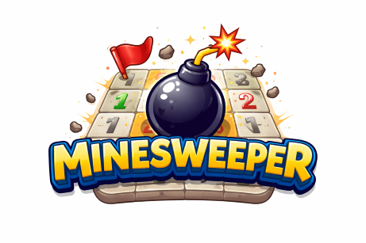

---

# Minesweeper AI

## Overview



**Minesweeper **is a logic puzzle game played on a grid of hidden cells, some of which contain mines. When you click a safe cell, it reveals a number indicating how many mines are in the neighboring cells. Using these numbers as clues, the player must logically determine which nearby cells contain mines and which are safe to open, without guessing if possible. The goal is to uncover all safe cells while avoiding the mines.

[Minesweeper Online](https://minesweeper.online/game/3055976707)


## Knowledge Map Approach

Minesweeper solver uses **logical reasoning**.  

It builds a **knowledge map** that stores constraints about the board and repeatedly simplifies those constraints until new information cannot be found.

This is an example of a **knowledge-based AI system**.

---

# 1. What Is the Knowledge Map?

The knowledge map stores rules (also called *sentences*) in the form:

```
{set of cells} → mine count
```

Example:

```
km[a, b, c] = 1
```

Meaning:

> Exactly 1 of the cells a, b, or c is a mine.

Each numbered square in Minesweeper generates one of these rules.

The AI does not store the whole board —
it stores only the **constraints** derived from revealed numbers.

In Python we can use a **Dictionary** to store our knowledge map.

```python
# knowledge model using Python Dictionary
km = {}

# Sample Board and Knowlege Model
# (show your sample board in same format)
# 
# abcd
# 1121
#

km["a,b"] = 1
km["a,b,c"] = 1
km["b,c,d"] = 2
km["c,d"] = 1
```
---

# 2. What the AI Is Trying to Determine

The system maintains three things:

* **Mines** → cells proven to contain mines
* **Clear cells** → cells proven safe to open
* **Knowledge map (constraints)** → remaining logical rules

The goal is to move cells from the knowledge map into either:

✔ Mine
✔ Safe

---

# 3. The Core Logic Rules

The AI repeatedly applies three reasoning steps.

---

## Rule 1 — Direct Logical Conclusions

For each sentence:

### If count = 0

All listed cells are safe.

Example:

```
km[a, b, c] = 0
```

All three are safe.

---

### If count = number of cells

All listed cells are mines.

Example:

```
km[a, b, c] = 3
```

All three are mines.

---

## Rule 2 — Simplify Using Known Information

If we already know some cells are mines or safe:

* Remove known mines from the sentence
* Decrease the mine count accordingly
* Remove known safe cells

This reduces the size of the sentence and may trigger Rule 1.

---

## Rule 3 — Subset Inference (Key Idea)

If one sentence is fully contained inside another, we can subtract them.

Example:

```
km[a, b] = 2
km[a, b, c] = 2
```

Since one mine is already in `{a, b}`,
the remaining mine must be in `{c}`.

So we create a new sentence:

```
km[c] = 1
```

This is called **constraint subtraction**.

---

# 4. The Iterative Process

The AI:

1. Applies direct rules
2. Simplifies sentences
3. Performs subset subtraction
4. Updates known mines and safe cells

Then it repeats.

The loop stops when no new information can be discovered.

---

# 5. Summary and Key Takeaways

This is an example of:

* Constraint reasoning
* Logical inference
* Knowledge representation

The AI is not searching randomly.
It is systematically narrowing possibilities until only one logical answer remains.

Minesweeper can be solved logically by:

* Representing clues as mathematical constraints
* Simplifying those constraints
* Repeatedly applying logical inference

This is exactly how many AI systems reason about problems:
store knowledge → simplify → infer → repeat.

-- end --