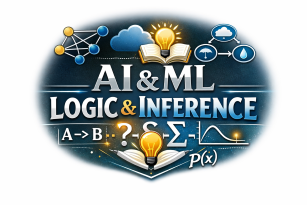

# CS 362 Artificial Intelligence and Machine Learning
**Spring 2026**  
**60 points**  
**Due: Tuesday, March 10th at 5 pm.**
## P5 Knowledge Models and Uncertainty

### A. (30 points) Minesweeper Knowlege Map

Using the Minesweeper AI Agent algorithm discussed in class, create and simplify and knowledge map for the game of Minesweeper for three different Minesweeper games. Pick a small board (say 4 x 4) with 6 to 10 unknown tiles. Label the tiles a, b, c … and create a knowledge map.

Simplify the knowledge map until no additional information (ie. mines and positions to open) can be found.

Add each of your sample knowledge maps (original to final simplified) to a single word processing document. Looking for either scanned hand-drawn work or neatly typed work.

**Note:** Output from program below will not be accepted.

For each of your three games show the following

1. Show the original game (screenshot or type)  
2. Starting knowledge map ie. {a,b,c} = 2  
3. Steps taken to simplify and find mines/open positions  
4. Final knowledge map  

---

### B. (10 points) Minesweeper code.

Use the code in [`MinesKnowledgeModel_Lehman.py`](./MinesKnowlegeModel_Lehman.py) to verify your work.  
Code **one of your games** using this file and upload the file `MinesKnowledgeModel_YourName.py` (ie. MinesKnowledgeModel_Amy_Smith)

---

### C. (20 points) Logic

Using the logic examples from Harvard’s CS 50 course `logic.py` and [`testLogic.py`](./testLogic.py)
Update the `testLogic.py` for a sample scenario. Rename the file `testLogic_YourName.py` (ie. testLogic_Amy_Smith)
Describe the scenario in your comments and add your name and date.

You will upload your modified `testLogic.py`.

Note: See [`harryLogic.py`](./harryLogic.py) for sample from Harvard video lecture.

See [mastermind class example](./mastermind_lehman.py)

---

### As a single .zip file

1. `testLogic_YourName.py`  
2. Three knowledge maps (.pdf)  
3. `MinesKnowledgeModel_YourName.py` 

---

-- end --

