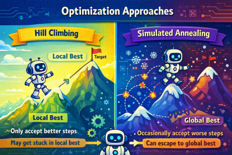

# Class Demo – Optimization Game

---

## Setup

1. Instructor selects a **random number (1–100)**  
2. Instructor selects a **random starting student**  
3. Each student picks a **random number (1–100)**  
   - Write it on a piece of paper  
   - Do **not share your number**  
4. Instructor **reveals the target number**  
5. Give the starting student the **🏆 trophy (current solution)**

---

## Goal

Minimize your **distance to the target**:

> distance = |your number – target|

- The student holding the 🏆 is the **current solution**
- The trophy 🏆 shows where we are ie. the best solution we have seen so far
- You may compare values with **neighboring students**  
  (N, S, E, W, NE, NW, SE, SW)
  

---

## Movement Rule

- If moving, **pass the 🏆 to the chosen neighbor**
- The numbers **do not change**
- The 🏆 represents the **current state moving through the space**

---
# Approach 1 – Local Search (Greedy / Hill Climbing)
---

## Goal
Find a better solution by moving to a **better neighbor**

---

## Process

1. Start with the student holding the 🏆  
2. Look at **neighboring students**
3. If a neighbor has a **better value (closer to target)**:
   - Pass the 🏆 to the **best neighbor**
4. **Repeat** steps 2–3
5. **Stop** when **no neighbor is better**

---

## Key Takeaways

> You may get stuck in a **local minimum**

- No better neighbor nearby  
- But not the best overall solution  
- You do not know if this is the best solution  
- Always choosing the best local move does not guarantee finding the **global optimum**

---
# Approach 2 – Simulated Annealing (Improved Local Search)
---

## Goal
Find a better solution by exploring neighbors while **occasionally accepting worse moves**

> **Annealing (metals):** When metals are heated, atoms move freely; as they cool slowly, they settle into a stable, low-energy structure.  
> Simulated annealing follows this idea: **start with flexibility (randomness), then gradually reduce it**.

---

## Process

Start with the student holding the 🏆  

1. Look at **ALL neighboring students**

2. Identify the **best neighbor** (closest to the target)
   - If the best neighbor is **better**, then **Move** (pass the 🏆)
   - Else: If the best neighbor is **worse**, then Roll two dice 🎲 :
      - If dice meet threshold (see below), then **Move**, otherwise **Stay**

3. Gradually **reduce randomness over time**  
   - *(cooling / lowering temperature)*
   - rate of **cooling** can be varied

4. **Repeat (go to step 1.) ** until the system “stabilizes”

**Probability of Accepting Worse Moves (2 Dice 🎲🎲)**

| Stage        | Temperature | Threshold | Percent |
|--------------|------------|----------|---------|
| Rounds 1–2   | High       | 7+       | 58.3%   |
| Rounds 3–4   | Medium     | 9+       | 27.8%   |
| Rounds 5–6   | Low        | 11+      | 8.3%    |

---

## Key Takeaways

> **Early**: explore more (accept worse moves)  
> **Later**: refine solution (accept only better moves)

- Can **escape local minima**
- Accepting worse moves becomes **less likely over time**
- More likely to find a **better overall (global) solution**
- May take longer
- Does **not guarantee** the absolute best solution

---

-- end --