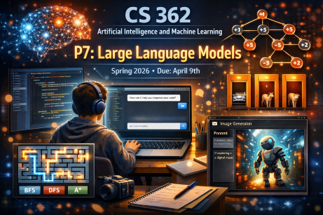

# CS 362 Artificial Intelligence and Machine Learning
**Spring 2026**  
**60 points**  
**Due: Thursday, April 9th at 5 pm.**
## P7 Large Language Models

---
### Resource Links

* [Large Language Models for scratch Part 1. - Steve Seitz](https://www.youtube.com/watch?v=lnA9DMvHtfI)
* [Large Language Models for scratch Part 2. - Steve Seitz](https://www.youtube.com/watch?v=YDiSFS-yHwk&list=PLWfDJ5nla8UoR8P7AGqVw7ZPjXajUFLMo&index=3)

* [prompt hero](https://prompthero.com/)
* [deepai image generator](https://deepai.org/machine-learning-model/text2img)

* [Google Notebook LM](https://notebooklm.google/)
* [Google Gemini](https://gemini.google.com/)
* [ChatGPT](https://chatgpt.com/)
* [Microsoft CoPilot](https://copilot.microsoft.com/)
* [Anthropic Claude](https://claude.ai/login)
* [Open Claw](https://openclaw.ai/)

---

### A. Vibe Coding (30 points) 

Use a large language model (LLM)- based AI system such as OpenAI’s ChatGPT, Microsoft’s Copilot, or Anthropic's Claude.
to improve one of Prof. Lehman's demo Python programs.

For example ...
* Add graphical tree for minimax tic tac toe example
* Add graphics to the Minesweeper knowledge example
* Create a GUI for creating search graphs
* Add menu options to the search GUI for BFS, DFS, A*
* Create a Monty Hall simulation

Add a comment header with the name of the Python file, your name, the date, and a brief description.

In a **P7 summary document*** under Part A, include the following:
0. Add your first and last name to the document and the date

1. Add a paragraph (or more) describing the improvement(s) you made.
2. Clearly identify the AI system you are using, including version, i.e., ChatGPT 4.5 thinking and paid vs. Free.
3. Add a paragrph (or more) identify any issues or problems you encountered.
4. Keep a running list of the prompts you used, number them, and add them to your comments. 

Upload a final copy of your Python code (ie, `bowling.py`).

### B. Images (15 points) 

Use AI to create a supporting image for your improvement in part A.

In your **P7 summary document*** under Part B, include the following:

1. Clearly identify the AI system you are using, including version
2. List the prompt(s) you used
3. Describe any issues or problems you encountered

### C. Notebook LM (15 points) 

Use Notebook LM to create a slide deck (x3 slides), audio overview, or video overview describing your improvement for part A.

In your **P7 summary document*** under Part C, include the following:

1. List the prompt(s) you used
2. List the resources you uploaded
2. Describe any issues or problems you encountered

---

### Assignment Submission

Upload a .pdf of your **`P7 summary document`** and your **`python file.py`**

---

-- end --

