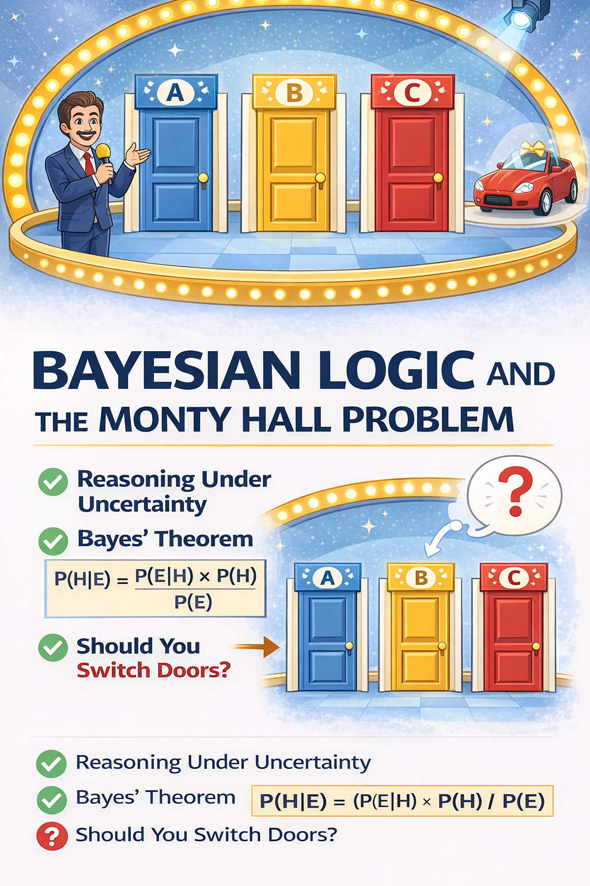
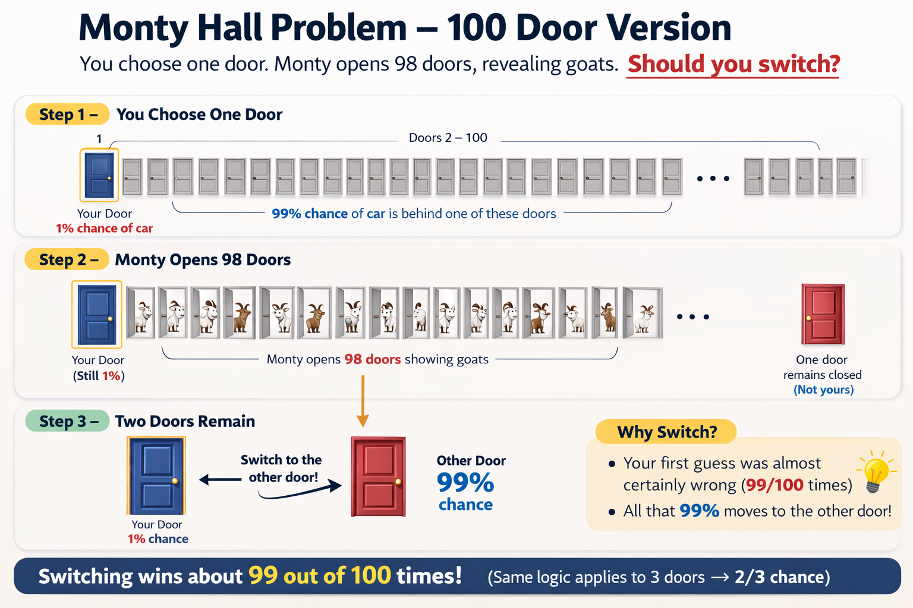

# Bayesian Logic and the Monty Hall Problem

## Bayesian Logic

In many real-world situations we must make decisions without knowing all the facts. Instead of treating statements as simply **true or false**, Bayesian logic allows us to represent uncertainty using probabilities. These probabilities represent how strongly we believe a particular explanation or outcome might be correct.

Bayesian reasoning is based on the idea that our beliefs should change when we receive new information. We begin with an initial estimate of how likely something is (called a **prior probability**). When new evidence appears, we update that belief mathematically to produce a **posterior probability**. This process of updating beliefs using evidence is known as **Bayesian inference** and is based on a mathematical rule called **Bayes’ Theorem**, which combines our prior belief with the likelihood of the observed evidence.

In simple terms, Bayesian reasoning answers the question:

> **“Given what we just observed, how should we update what we believe?”**

This approach is widely used in artificial intelligence and machine learning because it provides a systematic way to improve predictions as more data becomes available.

Examples include:

* Spam email filtering
* Medical diagnosis systems
* Speech recognition
* Recommendation systems

In each of these cases, the system begins with prior probabilities and **continuously updates them as new data is observed**.

---

# Bayes’ Theorem (The Math Stuff)

The mathematical foundation of Bayesian reasoning is **Bayes’ Theorem**.

```
P(H|E) = ( P(E|H) × P(H) ) / P(E)
```

Where:

| Symbol | Meaning                                                         |
| ------ | --------------------------------------------------------------- |
| H      | Hypothesis (a possible explanation)                             |
| E      | Evidence that has been observed                                 |
| P(H)   | Prior probability of the hypothesis                             |
| P(E\|H) | Probability of observing the evidence if the hypothesis is true |
| P(E)   | Total probability of the evidence                               |
| P(H\|E) | Posterior probability (updated belief after observing evidence) |

### In simple terms

```
Posterior = (Likelihood × Prior) / Evidence
```

This means our **updated belief** depends on:

1. **Prior probability** — what we believed before seeing the evidence
2. **Likelihood** — how well the hypothesis explains the evidence

---

# Example: The Monty Hall Problem



The **Monty Hall problem** is a classic probability puzzle based on a television game show.

### Game Setup

There are **three doors**:

* Behind one door is a **car** (the prize)
* Behind the other two doors are **goats**

Steps of the game:

1. The player chooses one door.
2. The host (Monty) opens a different door revealing a goat.
3. The player may either

   * **Stay** with the original choice
   * **Switch** to the remaining unopened door

The question is:

> **Should the player switch doors?**

Many people assume the probability becomes **50–50**, but Bayesian reasoning shows that switching actually gives a **2/3 chance of winning**.

---

# Initial Probabilities

Assume the player initially selects **Door A**.

| Car Location | Probability |
| ------------ | ----------- |
| Door A       | 1/3         |
| Door B       | 1/3         |
| Door C       | 1/3         |

---

# Monty Opens a Door

Suppose Monty opens **Door C** and reveals a goat.

This is **new evidence**.

We now update the probabilities using Bayesian reasoning.

---

# Likelihood of Monty Opening Door C

| Hypothesis | Car Location | P(Open C) |
| ---------- | ------------ | --------- |
| H₁         | Car at A     | 1/2       |
| H₂         | Car at B     | 1         |
| H₃         | Car at C     | 0         |

Explanation:

* If the car is behind **A**, Monty could open **B or C**, so probability = **1/2**.
* If the car is behind **B**, Monty must open **C**, so probability = **1**.
* If the car is behind **C**, Monty cannot open **C**, so probability = **0**.

---

# Applying Bayes’ Theorem

Multiply **prior probability × likelihood**.

| Hypothesis | Prior | Likelihood | Product |
| ---------- | ----- | ---------- | ------- |
| Car at A   | 1/3   | 1/2        | 1/6     |
| Car at B   | 1/3   | 1          | 1/3     |
| Car at C   | 1/3   | 0          | 0       |

Normalize the probabilities.

```
Total = 1/6 + 1/3 = 1/2
```

Updated probabilities:

| Door   | Posterior Probability |
| ------ | --------------------- |
| Door A | 1/3                   |
| Door B | 2/3                   |

---

# Final Result

After Monty opens Door C:

* **Stay with Door A → 1/3 chance of winning**
* **Switch to Door B → 2/3 chance of winning**

Therefore:

> **Switching doors doubles the probability of winning.**

---

# The 100-Door Version (Intuition)

To make the logic clearer, imagine a version with **100 doors**.

* 1 door has a **car**
* 99 doors have **goats**

You choose **one door**.

| Choice                   | Probability |
| ------------------------ | ----------- |
| Your door                | 1/100       |
| All other doors combined | 99/100      |

Monty then opens **98 goat doors**.

Only two doors remain:

* Your original door
* One remaining unopened door

Your original choice **still only had a 1/100 chance** of being correct.

The remaining door therefore has:

```
99/100 probability
```

So switching wins **99% of the time**.

---

---

# Bayesian Analysis of the 100-Door Problem

Assume you choose **Door 1**.

Possible hypotheses:

| Hypothesis | Meaning             |
| ---------- | ------------------- |
| H₁         | Car behind Door 1   |
| H₂         | Car behind Door 2   |
| ...        | ...                 |
| H₁₀₀       | Car behind Door 100 |

### Prior probability

```
P(Hᵢ) = 1/100
```

---

# Evidence

Monty opens **98 goat doors**, leaving:

* Door 1
* Door k

```
E = Monty opens 98 goat doors
```

---

# Likelihoods

If the car is behind **Door 1**:

```
P(E|H₁) = 1/99
```

Monty could leave any of the other 99 doors closed.

If the car is behind **Door k**:

```
P(E|Hₖ) = 1
```

Monty must leave that door closed.

If the car were behind any door Monty opened:

```
P(E|Hⱼ) = 0
```

---

# Compute Posterior Probabilities

Door 1:

```
P(E|H₁) × P(H₁)
= (1/99) × (1/100)
= 1/9900
```

Door k:

```
P(E|Hₖ) × P(Hₖ)
= 1 × (1/100)
= 1/100
```

Normalize:

```
P(E) = 1/9900 + 1/100
     = 100/9900
```

---

# Final Posterior Probabilities

Your door:

```
P(H₁|E) = 1/100
```

Remaining door:

```
P(Hₖ|E) = 99/100
```

---

# Key Insight

The Bayesian calculation confirms the intuition:

* Your first guess remains **1/100**
* The remaining door inherits **99/100 probability**

Therefore:

```
Switching wins about 99% of the time.
```

---

# Summary

Bayesian reasoning provides a powerful framework for reasoning under uncertainty.

Steps:

1. Start with **prior probabilities**
2. Observe **new evidence**
3. Apply **Bayes’ Theorem**
4. Compute **posterior probabilities**

The Monty Hall problem demonstrates how **new information can dramatically change probabilities**, even when our intuition suggests otherwise.

---

-- end --
